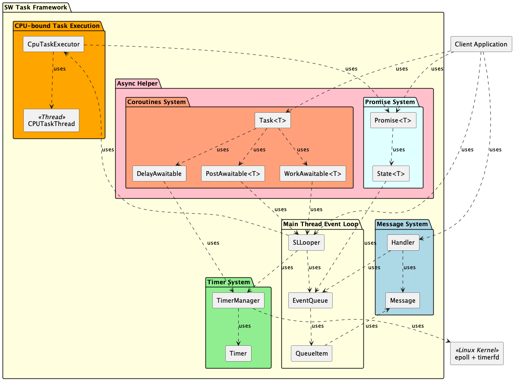

# SW Task Framework

[](https://github.com/taikt/sw_task/actions/workflows/build.yml)
[](https://taikt.github.io/sw_task/)
[](https://opensource.org/licenses/MIT)
[](https://en.cppreference.com/w/cpp/17)

**Advanced C++ Event Loop Framework for High-Performance Asynchronous Task Management**

SW Task Framework is a modern event loop framework designed to efficiently and safely manage asynchronous tasks. The framework provides a flexible architecture for handling messages, timers, promises, and CPU-bound operations in multi-threaded C++ applications.

## Table of Contents

- [Features](#features)
- [Architecture](#architecture)
- [API Overview](#api-overview)
- [Examples](#examples)
- [Building](#building)
- [Testing](#testing)
- [Performance](#performance)
- [Contributing](#contributing)
- [License](#license)

## Features

### Core Components

| Component           | Description                        | Key Features                                    |
|---------------------|------------------------------------|-------------------------------------------------|
| **SLLooper**        | Main event loop coordinator        | Thread-safe posting                             |
| **EventQueue**      | High-performance Event queue       | Priority handling, delayed execution, templates  |
| **TimerManager**    | Precise timer management           | One-shot & periodic timers, microsecond precision|
| **Promise System**  | Modern async pattern (JS A+)       | Chainable continuations, error handling         |
| **Handler Pattern** | Message-based communication        | Android-style messaging, flexible dispatching    |
| **CPU Task Executor** | CPU-bound task isolation         | Timeout protection                              |

### Advanced Features

- **Asynchronous Task Management**: Post functions with futures, delayed execution, promise-based workflows following JavaScript/A+ standard
- **High-Precision Timers**: Microsecond accuracy, chrono duration support, RAII timer management
- **Thread-Safe Operations**: Lock-free queues, atomic operations, safe cross-thread communication
- **CPU-Bound Task Isolation**: Separate CPU-bound task thread for intensive operations, prevents event loop blocking
- **Android-Style Messaging**: Familiar Handler/Message pattern for structured communication
- **Modern C++ Design**: C++17 features, RAII principles, smart pointer management

## Architecture

### System Overview



### Thread Model

```
Main Thread              Event Loop Thread           CPU-bound Task thread
     │                          │                           │
     │ post(normal_task)        │                           │
     ├─────────────────────────►│                           │
     │                          │ process tasks             │
     │ postWork(heavy_task)     │ delegate                  │
     ├─────────────────────────►│ ─────────────────────────►│
     │                          │                           │ execute
     │                          │◄──────────────────────────┤
     │◄─────────────────────────┤ result via promise        │
     │ promise.then()           │                           │
```

## API Overview

### 1. Function Posting & Promise

<!-- 
  For Doxygen-generated documentation, use \ref for hyperlinks.
  If this README is processed by Doxygen, these will be clickable links.
-->

| Category           | API Name                                                                                                   | Description                                                        |
|--------------------|-----------------------------------------------------------------------------------------------------------|--------------------------------------------------------------------|
| Function Posting   | \ref swt::SLLooper::post "post(func, args...)"                                                            | Post task to event loop, returns `std::future`                     |
|                    | \ref swt::SLLooper::postDelayed "postDelayed(delayMs, func, args...)"                                     | Post delayed task, returns `std::future`                           |
|                    | \ref swt::SLLooper::postWithTimeout "postWithTimeout(func, timeout_ms)"                                   | Post task with timeout, returns `Timer`                            |
| Promise            | \ref swt::SLLooper::createPromise "createPromise<T>()"                                                    | Create manual promise                                              |
|                    | \ref swt::SLLooper::postWork "postWork(func)"                                                             | Run CPU-bound task, returns `Promise`                              |
|                    | \ref swt::SLLooper::postWork "postWork(func, timeout)"                                                    | Run CPU-bound task with timeout                                    |
|                    | \ref swt::Promise::set_value "Promise::set_value(value)"                                                  | Fulfill promise                                                    |
|                    | \ref swt::Promise::then "Promise::then(callback)"                                                         | Chain callback on success                                          |
|                    | \ref swt::Promise::catchError "Promise::catchError(callback)"                                             | Chain error handler                                                |

---

### 2. Timer & Timer Control

| Category      | API Name                                              | Description                                 |
|---------------|-------------------------------------------------------|---------------------------------------------|
| Timer         | \ref swt::SLLooper::addTimer "addTimer(cb, delay)"    | One-shot timer                              |
|               | \ref swt::SLLooper::addPeriodicTimer "addPeriodicTimer(cb, interval)" | Periodic timer                  |
| Timer Control | \ref swt::Timer::cancel "Timer::cancel()"             | Cancel timer                                |
|               | \ref swt::Timer::isActive "Timer::isActive()"         | Check if timer is active                    |
|               | \ref swt::Timer::restart "Timer::restart(delay)"      | Restart timer                               |

---

### 3. Message & Handler

| Category           | API Name                                              | Description                                |
|--------------------|------------------------------------------------------|--------------------------------------------|
| Message Creation   | \ref swt::Handler::obtainMessage "obtainMessage()"   | Create empty message                       |
|                    | \ref swt::Handler::obtainMessage "obtainMessage(what, ...)" | Create message with code/args      |
| Message Sending    | \ref swt::Handler::sendMessage "sendMessage(msg)"    | Send message immediately                   |
|                    | \ref swt::Handler::sendMessageDelayed "sendMessageDelayed(msg, delay)" | Send message after delay         |
| Message Management | \ref swt::Handler::hasMessages "hasMessages(what)"   | Check if messages exist                    |
|                    | \ref swt::Handler::removeMessages "removeMessages(what)" | Remove messages                      |
| Processing         | \ref swt::Handler::dispatchMessage "dispatchMessage(msg)" | Dispatch to handler                  |
|                    | \ref swt::Handler::handleMessage "handleMessage(msg)" | Override to process message           |

---

## Examples

### 1. Function Posting & Promise

**Chained asynchronous workflow with error handling:**
```cpp
#include "SLLooper.h"
#include <iostream>
#include <stdexcept>
#include <thread>

int computeHeavy(int x) {
    if (x < 0) throw std::runtime_error("Negative input!");
    std::this_thread::sleep_for(std::chrono::milliseconds(100));
    return x * x;
}

int main() {
    auto looper = std::make_shared<SLLooper>();

    looper->postWork([] { return 10; })
    .then(looper, [looper](int v) {
        std::cout << "First result: " << v << std::endl;
        return looper->postWork([v] { return computeHeavy(v); });
    })
    .then(looper, [](int squared) {
        std::cout << "Squared: " << squared << std::endl;
        return squared / 2;
    })
    .catchError(looper, [](std::exception_ptr ex) {
        try { if (ex) std::rethrow_exception(ex); }
        catch (const std::exception& e) {
            std::cout << "Error: " << e.what() << std::endl;
        }
        return -1;
    })
    .then(looper, [](int final) {
        std::cout << "Final result: " << final << std::endl;
        return 0;
    });

    std::this_thread::sleep_for(std::chrono::milliseconds(500));
    return 0;
}
```

---

### 2. Timer & Timer Control

**Periodic timer with dynamic restart and cancellation:**
```cpp
#include "SLLooper.h"
#include <iostream>
#include <atomic>
#include <thread>

int main() {
    auto looper = std::make_shared<SLLooper>();
    std::atomic<int> count{0};

    auto timer = looper->addPeriodicTimer([&]() {
        std::cout << "Tick: " << ++count << std::endl;
        if (count == 3) {
            std::cout << "Restarting timer with new interval..." << std::endl;
            timer.restart(200);
        }
        if (count == 6) {
            std::cout << "Cancelling timer." << std::endl;
            timer.cancel();
        }
    }, 100);

    std::this_thread::sleep_for(std::chrono::milliseconds(1500));
    return 0;
}
```

---

### 3. Message & Handler

**Custom handler with message dispatch and delayed messaging:**
```cpp
#include "SLLooper.h"
#include "Handler.h"
#include <iostream>
#include <memory>
#include <thread>

class MyHandler : public Handler {
public:
    MyHandler(std::shared_ptr<SLLooper> looper) : Handler(looper) {}
    void handleMessage(const std::shared_ptr<Message>& msg) override {
        if (msg->what == 1) {
            std::cout << "Process data: " << msg->arg1 << std::endl;
        } else if (msg->what == 2) {
            std::cout << "Delayed event: " << msg->arg2 << std::endl;
        }
    }
};

int main() {
    auto looper = std::make_shared<SLLooper>();
    auto handler = std::make_shared<MyHandler>(looper);

    auto msg1 = handler->obtainMessage(1, 42, 0);
    handler->sendMessage(msg1);

    auto msg2 = handler->obtainMessage(2, 0, 99);
    handler->sendMessageDelayed(msg2, 200);

    std::this_thread::sleep_for(std::chrono::milliseconds(500));
    return 0;
}
```

---

### 4. Combined Example: Timer, Promise, and Handler

**Workflow: Timer triggers a fetch, result is processed and sent to handler**
```cpp
#include "SLLooper.h"
#include "Handler.h"
#include <iostream>
#include <thread>

class ResultHandler : public Handler {
public:
    ResultHandler(std::shared_ptr<SLLooper> looper) : Handler(looper) {}
    void handleMessage(const std::shared_ptr<Message>& msg) override {
        std::cout << "Handler received: " << msg->arg1 << std::endl;
    }
};

int fetchData() {
    std::this_thread::sleep_for(std::chrono::milliseconds(100));
    return 123;
}

int main() {
    auto looper = std::make_shared<SLLooper>();
    auto handler = std::make_shared<ResultHandler>(looper);

    auto timer = looper->addTimer([looper, handler]() {
        looper->postWork(fetchData)
        .then(looper, [handler](int value) {
            auto msg = handler->obtainMessage(1, value, 0);
            handler->sendMessage(msg);
        });
    }, 200);

    std::this_thread::sleep_for(std::chrono::milliseconds(500));
    return 0;
}
```

---

## Building

### Requirements

- **C++17 compatible compiler** (GCC 7+, Clang 6+, MSVC 2017+)
- **CMake 3.12+**
- **Optional**: Doxygen for documentation

### Build Instructions

```bash
git clone https://github.com/taikt/sw_task.git
cd sw_task
mkdir build && cd build
cmake ..
make -j$(nproc)
make test
sudo make install
```

---

## Testing

```bash
cd build
make test
ctest --verbose
```

---

## Performance

| Operation        | Throughput | Latency | Memory           |
|------------------|------------|---------|------------------|
| Task Posting     | 1M ops/sec | < 1μs   | 64 bytes/task    |
| Timer Creation   | 100K/sec   | < 10μs  | 128 bytes/timer  |
| Promise Chain    | 500K/sec   | < 5μs   | 256 bytes/chain  |
| Message Send     | 2M ops/sec | < 0.5μs | 32 bytes/msg     |

---

## Contributing

- **C++17 standard compliance**
- **Google C++ Style Guide**
- **Comprehensive unit tests for new features**
- **Doxygen documentation for public APIs**
- **RAII principles and smart pointer usage**

---

## License

MIT License

Copyright (c) 2025 Tran Anh Tai

Permission is hereby granted, free of charge, to any person obtaining a copy
of this software and associated documentation files (the "Software"), to deal
in the Software without restriction, including without limitation the rights
to use, copy, modify, merge, publish, distribute, sublicense, and/or sell
copies of the Software, and to permit persons to whom the Software is
furnished to do so, subject to the following conditions:

The above copyright notice and this permission notice shall be included in all
copies or substantial portions of the Software.

THE SOFTWARE IS PROVIDED "AS IS", WITHOUT WARRANTY OF ANY KIND, EXPRESS OR
IMPLIED, INCLUDING BUT NOT LIMITED TO THE WARRANTIES OF MERCHANTABILITY,
FITNESS FOR A PARTICULAR PURPOSE AND NONINFRINGEMENT. IN NO EVENT SHALL THE
AUTHORS OR COPYRIGHT HOLDERS BE LIABLE FOR ANY CLAIM, DAMAGES OR OTHER
LIABILITY, WHETHER IN AN ACTION OF CONTRACT, TORT OR OTHERWISE, ARISING FROM,
OUT OF OR IN CONNECTION WITH THE SOFTWARE OR THE USE OR OTHER DEALINGS IN THE
SOFTWARE.

---

**Author**: Tran Anh Tai  
**Email**: tai2.tran@lge.com (taitrananhvn@gmail.com)  
**Repository**: [https://github.com/taikt/sw_task](https://github.com/taikt/sw_task)  
**Documentation**: [https://taikt.github.io/sw_task/](https://taikt.github.io/sw_task/)